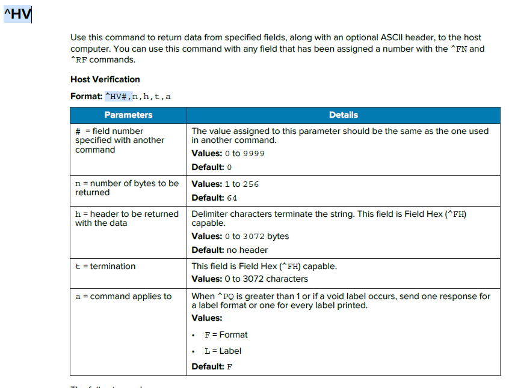

## Zebra-Printer_Recieve-Encode Results from RFID Printers
## Zebra RFID プリンタからエンコード結果を取得

^HVを用いる方法とRFIDログを用いる方法がある。

- リアルタイム性を優先するのであれば^HV
- エラーを含めた詳細情報取得であればRFIDログ
  
<br>
<br>

-----

1. Host Verification コマンドを活用する

   
    ZPL:^HVコマンドを用いることで、^FN/^RFにアサインされたデータをホストに送信することができる。<br>


    
    <br>


    #### ZPL例：Write後のTID、EPCデータを取得
    ```zpl
    ^XA
    ^RS8
    ^RFW,H
    ^FDAAAA12345678901234567890^FS
    ^RFR,H,0,8,2^FN1^FS
    ^FH_^HV1,,8-byte Tag ID Data:[,]_0D_0A^FS
    ^RFR,H^FN2^FS
    ^FH_^HV2,,All EPC Data:[,]_0D_0A^FS
    ^XZ
    ```
    <br>


    #### 返信例：

    ```
    8-byte Tag ID Data:[E20034120131F300]
    All EPC Data:[AAAA12345678901234567890]
    ```
    <br>


    #### Windows-Java Sample Code例

    ```java
    public class App {

    static String printerDriverName2 = "ZDesigner ZD611R-300dpi ZPL";

    // ZPL: Recieve RFID Feedback Data
    static String zplData2 = """
        ^XA
        ^RS8
        ^RFR,H,0,8,2^FN1^FS
        ^FH_^HV1,,8-byte Tag ID Data:[,]_0D_0A^FS
        ^RFR,H^FN2^FS
        ^FH_^HV2,,All EPC Data:[,]_0D_0A^FS
        ^XZ        
        """;

        public static void main(String[] args) throws Exception {
            new App().sendRecieveZplOverUsb(printerDriverName2, zplData2);
        }


        public void sendRecieveZplOverUsb(String printerName, String zplData) throws ConnectionException, InterruptedException {
        
            // Instantiate connection for ZPL USB port for given printer name
            Connection thePrinterConn = new DriverPrinterConnection(printerName);

            try {
                // Open the connection - physical connection is established here.
                thePrinterConn.open();

                // ByteArrayでZPLを送信
                thePrinterConn.write(zplData.getBytes());

                Thread.sleep(1000);

                // ByteArrayで受信データを受信
                byte[] b = thePrinterConn.read();
                String recieveString = new String(b);
                System.out.println(recieveString);
            } catch (ConnectionException e) {
                // Handle communications error here.
                e.printStackTrace();
            } finally {
                // Close the connection to release resources.
                thePrinterConn.close();
            }

        }
    ```

    </br>
    </br>


2. RFID Log データを活用する

    rfid.logデータ設定を有効化することでエンコード結果を取得できる。

    #### RFIDログ有効化設定

    ```
    ! U1 setvar "rfid.log.enabled" "yes"
    ```
    <br>


    #### ZPL例：Write後のTID、EPCデータを取得
    ```zpl
    ^XA
    ^RS8
    ^RFW,H
    ^FDAAAA12345678901234567890^FS
    ^RFR,H,0,8,2^FS
    ^RFR,H
    ^XZ
    ```
    <br>


    #### コマンド：ログの参照
    ```
    ! U1 getvar "rfid.log.entries"
    ```
    <br>


    #### コマンド：ログのクリア
    ```
    ! U1 getvar "rfid.log.entries"
    ```
    <br>
    
    
    #### 実行例
    ```
    ! U1 setvar "rfid.log.clear" ""

    ! U1 getvar "rfid.log.entries"
    "<start>
    <end>
    "

    ^XA
    ^RS8
    ^RFW,H
    ^FDAAAA12345678901234567890^FS
    ^RFR,H,0,8,2^FS
    ^RFR,H
    ^XZ

    ! U1 getvar "rfid.log.entries"
    "<start>
    May-17-2024 20:03:20,W,B7,A1,22,00000000,AAAA12345678901234567890
    May-17-2024 20:03:20,R,B7,A1,18,00000000,E2003412013EF300
    May-17-2024 20:03:20,R,B7,A1,18,00000000,AAAA12345678901234567890
    <end>
    "
    ```
<br>
<br>


`関連コマンドやログの詳細は”ZPL II, ZBI 2, Set-Get-Do, Mirror,WML” マニュアルなどを参照すること。`

参考：Zebra Setup Utilities を使用して RFID データ ログを有効にして取得する
https://supportcommunity.zebra.com/s/article/000026343?language=ja